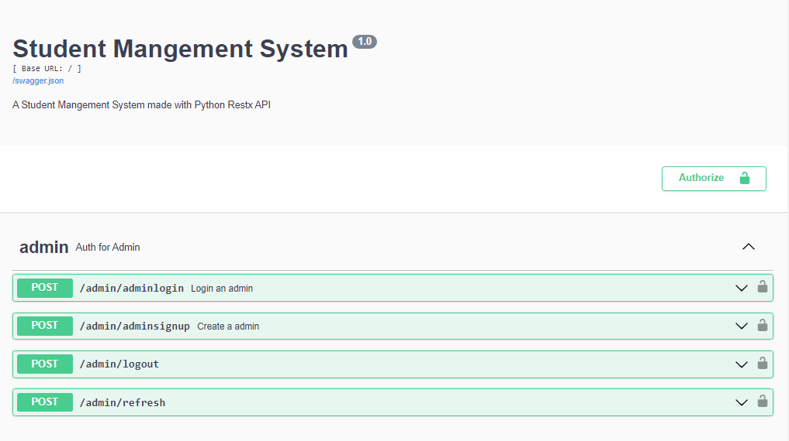
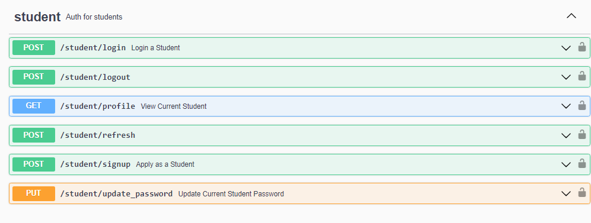
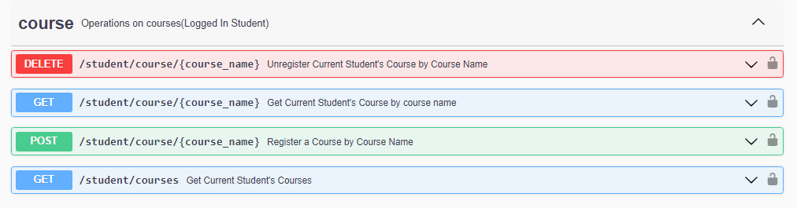
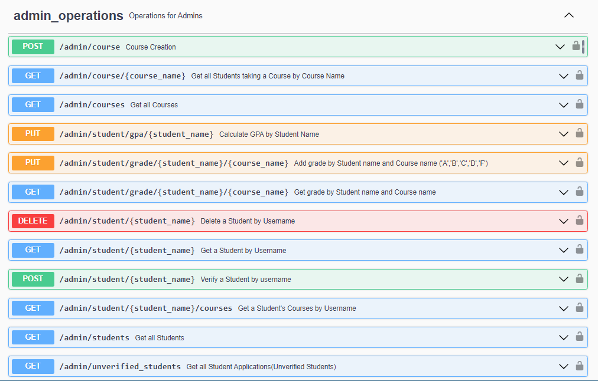
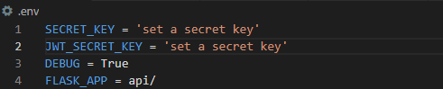

# SMS

Hosted live on [HERE](https://manor.pythonanywhere.com/)

SMS is an [AltSchool Africa](https://www.altschoolafrica.com/) 3rd Semester Back-End Examination project by [IGBINOSA CHRISTIAN](https://github.com/Igbinosa-Christian). It is a simple Student Management System API built with:

- [Python](https://www.python.org/) 
- [Flask](https://flask.palletsprojects.com/en/2.2.x/)
- [Flask-Restx](https://flask-restx.readthedocs.io/en/latest/) - Flask framework for building REST APIs.
- [VS CODE](https://code.visualstudio.com/) - Code Editor used for the project.
- [GIT](https://gitforwindows.org/) - Git Bash was used for Command Line.

## Terms
- **Admin** - Super User(s) that has access to Admin routes.
-  **Unverified Student** - A student that has applied for a student account by providing their name/username and email address(Cannot access student/admin routes).
- **Student** - A student that has been verified and given a password and ID by the Admin and now has access to student routes.

  


## Functionality
### Admins 
- Create an Admin (Possible to create multiple admins for the sake of API testing by multiple users).
- Login and Logout an Admin.
  <br/><br/>
- Get all Unverified Students.
- Get all Students.
- Get a Student by their name/username.
- Verify a Student by their username/name. When verification is done the Unverified Student will become a Student by being given a unique ID and a password ([Application Email]5555) e.g student1@gmail.com5555.
- Delete a Student by their name/username.
- Get all courses.
- Create a course.
- Get all the courses a Student is registered to by the Student's name/username.
- Get all the Students registered/taking a course by the Course's name.
- Add a Student's grade to a course by Student's name and Course name, accepted grades by the API are (A,B,C,D,F).
- Get grade of Student in a Course by Student name and course name.
- Calculate the GPA of a Student by Student name. GPA can only be calculated if all the courses a student is taking have been graded. 
  
### Student
- Apply for a Student Account by providing your name/username and email address.
- Login if your account has been verified and Logout.
- Update Student password.
- View profile(Student).
  <br/><br/>
- Get all the courses you're registered to.
- Get a course you're registered to by Course name.
- Register a Course by the Course's name. A Course can only be registered if it has been created by an Admin.
- Unregister a Course.
  





## Local Usage
To get a copy of this project on your local machine:

### Prerequisites
Download and install  [Python](https://www.python.org/downloads/) 

### Installation

1.Clone this repository. 
```sh
git clone https://github.com/Igbinosa-Christian/Student-Management-System.git
```

2.While in the cloned repository directory, create a virtual environment depending on your OS and CMD, this is for Windows Git Bash
```sh
python -m venv venv 
```


3.Activate your virtual environment.
```sh
source venv/Scripts/activate 
```

4.Install project packages/requirements
```sh
pip install -r requirements.txt
```


5.Create a .env file in Project Directory and set a SECRET_KEY, JWT_SECRET_KEY, DEBUG = True and FLASK_APP = api/


To get a secret key, open up your terminal and call python then do the following:
```sh
import secrets
secrets.token_hex(16)
```

6.Set Up Database. Do the following in your terminal.
```sh
flask shell
db.create_all()
```

7.Run the program
```sh
flask run
```

8.Open the link generated on the terminal via a browser.


## License
Under [MIT](https://github.com/Igbinosa-Christian/SMS)

## Contact
- [Twitter](https://twitter.com/_m_anor)
- Email igbinosa62@gmail.com
- [Project Repository](https://github.com/Igbinosa-Christian/Student-Management-System.git)
